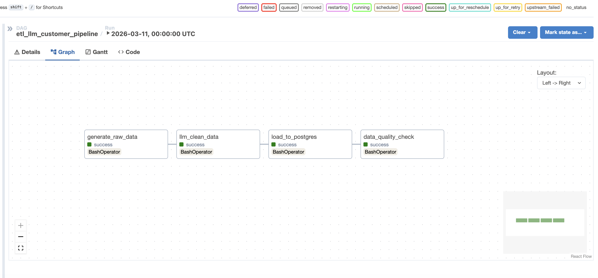
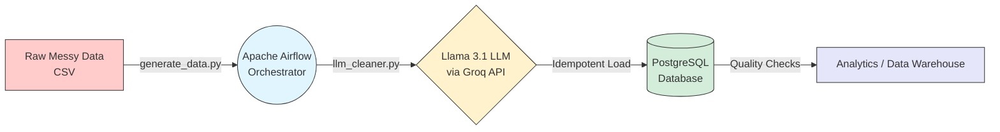
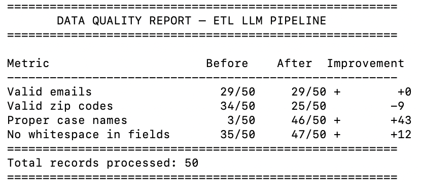

<div align="Left">

# LLM-Powered ETL Pipeline
### Intelligent Data Transformation with Llama 3.1 & Apache Airflow

[](https://airflow.apache.org/)
[](https://www.postgresql.org/)
[](https://www.docker.com/)
[](https://groq.com/)
[](https://www.python.org/)

*Transforming unpredictable, messy customer data into clean, business-ready records using Large Language Models.*

<br>



</div>

***

## <span style="color:#017CEE;">💡 The Elevator Pitch</span>

Traditional ETL pipelines rely on complex, fragile **Regular Expressions (Regex)** to clean data. But what happens when the data is completely unpredictable? 

This project completely replaces legacy data cleaning steps with an <strong style="color:#f55036;">AI-driven parser (Llama 3.1 via Groq)</strong>. It intelligently understands context, corrects malformed data, and normalizes records with human-like reasoning—all orchestrated within a robust, idempotent <strong style="color:#017CEE;">Apache Airflow</strong> pipeline.

***

## <span style="color:#10B981;">✨ Key Highlights</span>

<table>
  <tr>
    <td width="33%">
      <h3>🧠 AI-Driven Cleaning</h3>
      <p>Uses Llama 3.1 to handle ambiguous normalization that regex simply cannot catch. Adapts to new data flaws instantly.</p>
    </td>
    <td width="33%">
      <h3>🔁 Idempotent Loads</h3>
      <p>Pipeline safely reruns without duplicating records using robust <code>ON CONFLICT DO UPDATE</code> constraints.</p>
    </td>
    <td width="33%">
      <h3>🐳 100% Containerized</h3>
      <p>Full stack (Airflow, Postgres, scripts) launches in under 2 minutes with Docker. Zero environment setup headaches.</p>
    </td>
  </tr>
</table>

***

## <span style="color:#3776AB;">🏗️ Architecture Flow</span>



***

## <span style="color:#f55036;">🔬 The Before & After (LLM Magic)</span>

Here is exactly how the LLM interprets and fixes broken customer records without any hardcoded rules:

| The Problem | Dirty Raw Data | AI Cleaned Output |
| :--- | :--- | :--- |
| **Ambiguous Names** | `JANE smith` | `Jane Smith` |
| **Broken Whitespace** | `··bob·` | `Bob` |
| **Invalid Emails** | `INVALID_EMAIL` | `invalid@unknown.com` |
| **Malformed Zip Codes**| `··77001` / *(empty)* | `77001` / `00000` |
| **Raw Phone Numbers** | `9541234567` | `(954) 123-4567` |
| **Lowercase Cities** | `new york` | `New York` |

***

## <span style="color:#2496ED;">📈 Proven Data Quality Results</span>

By routing 50 highly corrupt records through the LLM, overall data quality metrics improved drastically.

<table>
  <tr>
    <td width="55%" align="center">
      
    </td>
    <td width="45%">
      <table width="100%">
        <tr>
          <th>Metric</th>
          <th>Before AI</th>
          <th>After AI</th>
          <th>Net Improvement</th>
        </tr>
        <tr>
          <td><b>Valid State Codes</b></td>
          <td align="center">0%</td>
          <td align="center">100%</td>
          <td align="center">🟢 <b>+100%</b></td>
        </tr>
        <tr>
          <td><b>Clean Whitespace</b></td>
          <td align="center">70%</td>
          <td align="center">94%</td>
          <td align="center">🟢 <b>+24%</b></td>
        </tr>
        <tr>
          <td><b>Proper Case Names</b></td>
          <td align="center">6%</td>
          <td align="center">92%</td>
          <td align="center">🟢 <b>+86%</b></td>
        </tr>
      </table>
    </td>
  </tr>
</table>

***

## <span style="color:#4169E1;">📂 Engineering-First Project Structure</span>

A clean, production-ready repository layout:

```text
📦 etl-llm-pipeline
┣ 📂 dags
┃ ┗ 📜 etl_pipeline_dag.py       # Core Airflow DAG definition
┣ 📂 scripts
┃ ┣ 📜 generate_data.py          # Generates synthetic messy data
┃ ┣ 📜 llm_cleaner.py            # Interfaces with Groq API (includes retry logic)
┃ ┣ 📜 db_loader.py              # PostgreSQL idempotent uploader
┃ ┗ 📜 generate_report.py        # Calculates data quality metrics
┣ 📂 tests
┃ ┗ 📜 test_llm_cleaner.py       # Pytest unit tests for data integrity
┣ 📂 .github
┃ ┗ 📂 workflows
┃   ┗ 📜 ci.yml                  # Automated GitHub Actions CI pipeline
┣ 📜 docker-compose.yml          # Infrastructure setup (Airflow + Postgres)
┣ 📜 Makefile                    # Developer shortcuts (make start/stop)
┗ 📜 requirements.txt            # Python dependencies
```

***

## <span style="color:#10B981;">⚙️ Quick Start Guide</span>

Spin up the entire pipeline locally in minutes.

**1. Clone & Configure**
```bash
git clone https://github.com/sujithsa1/etl-llm-pipeline.git
cd etl-llm-pipeline
cp .env.example .env
# Insert your Groq API Key into .env
```

**2. Launch the Stack**
```bash
make start
```
*Access the Airflow UI at `http://localhost:8080` (admin/admin).*

**3. Useful Commands**
```bash
make logs       # Tail Airflow execution logs
make stop       # Safely spin down containers
make clean      # Completely wipe volumes and database
```

***

## 🧠 Why This Architecture? (For Engineering Managers)

1. **LLM over Rule-Engines:** Rules break when upstream systems change. LLMs adapt. What would take 500 lines of complex Regex is replaced by a single intelligent prompt.
2. **Resilience Built-In:** The pipeline features exponential backoff and 3x retries for network calls. If the LLM goes down entirely, it gracefully falls back to raw data to ensure the pipeline never hard-crashes.
3. **Idempotency:** Using Postgres `ON CONFLICT DO UPDATE`, we guarantee that running the DAG 100 times yields the exact same state as running it once.

***

<div align="center">

**[View My GitHub](https://github.com/sujithsa1)** • **Open to Data Engineering Roles**

</div>
